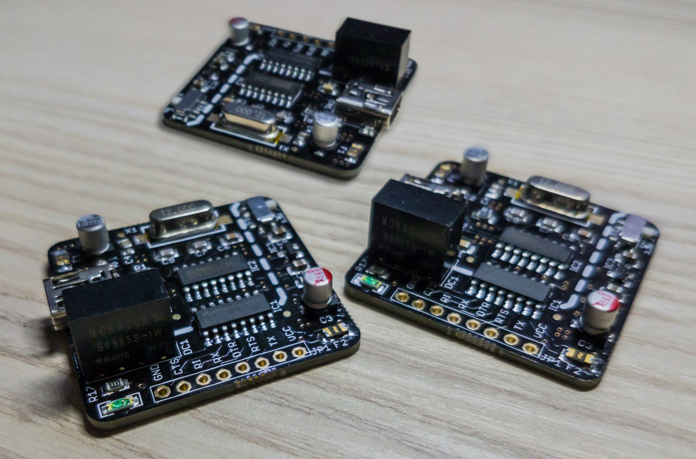
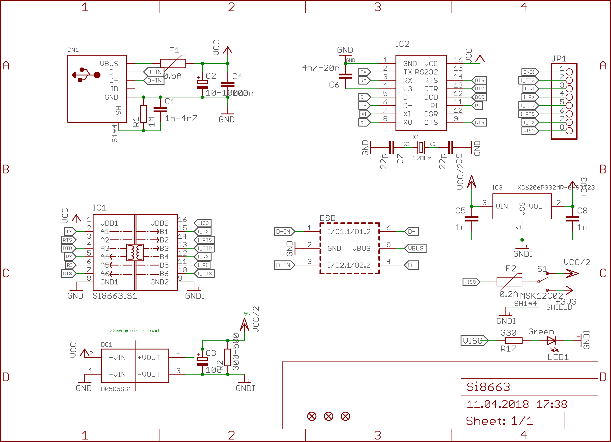
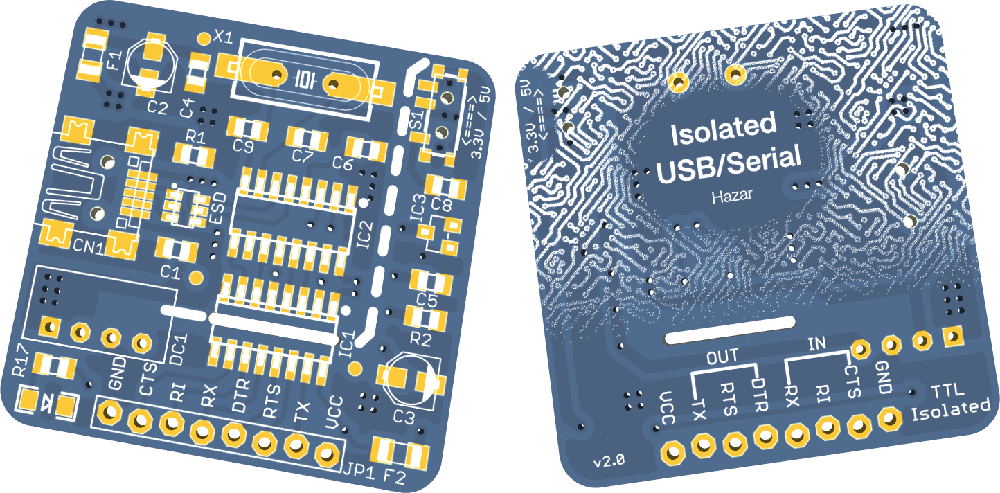

# Galvanically Isolated USB-Serial Converter

Galvanically Isolated USB-Serial Converter with internal, isolated power supply that you can use with different brands / models of programming kits, evaluation boards, SoCs and more. 

## Features:
- It provides 3 serial TTL inputs and 3 serial TTL outputs isolated from USB.
- Serial inputs: CTS, RI, RX
    - The RI input, which is not commonly used by programming kits but is in serial port standard, is also provided as an extra, and it is possible to use it as an extra TTL input with a suitable software.
- Serial outputs: DTR, RTS, TX
- Serial inputs and outputs are compatible with all common programming boards and development kits.
- Supported communication rates (baud rate): 300bps-1Mbps (2Mbps is optional)
- Supported operating systems: Windows, Mac OS, Linux, FreeBSD
- Continuous isolation up to 5000VRMS (instantaneous 50 kV/µs)
- Thanks to the internal isolated power supply, it does not require a separate supply for the insulated side and can operate the connected device.
- 3.3V and 5V support can be selected with the switch on the board. That determines the isolated side supply.
- Isolated power supply max. 200mA
- The USB input and the isolated power supply are protected against overcurrent.

### Physical properties:
- Size: 36×36mm
- Height: 13mm
- Weight: 7.6 gr. (8.2 gr. including pin headers)

## BOM
| Parts   | Qty | Value                | Device                         | Description                                                                     |
| ------- | --- | -------------------- | ------------------------------ | ------------------------------------------------------------------------------- |
| C1      | 1   | 1n-4n7               | C-EU                           | Multilayer Ceramic Capacitors MLCC - SMD/SMT 2.2nF 50V 0805 RoHS                |
| C2, C3  | 2   | 47u                  | CPOL-EUB                       | Aluminum Electrolytic Capacitors - SMD 47uF ±20% 10V SMD,4x5.4mm RoHS           |
| C4      | 1   | 100n                 | C-EU                           | Multilayer Ceramic Capacitors MLCC - SMD/SMT 100nF 50V 0805 RoHS                |
| C5, C8  | 2   | 1u                   | C-EU                           | Multilayer Ceramic Capacitors MLCC - SMD/SMT 1uF 50V 0805 RoHS                  |
| C6      | 1   | 10n                  | C-EU                           | Multilayer Ceramic Capacitors MLCC - SMD/SMT 10nF 100V 0805 RoHS                |
| C7, C9  | 2   | 22p                  | C-EU                           | Multilayer Ceramic Capacitors MLCC - SMD/SMT 22pF 50V 0805 RoHS                 |
| CN1     | 1   |                      | USBMINIB                       | USB Connectors 5 Receptacle 1 SMD RoHS                                          |
| DC1     | 1   | B0505SS1             | B0505SS1                       | Power Modules Isolated Module 1 4.5V 5.5V 1W 77% 1kVDC Through Hole RoHS        |
| ESD     | 1   |                      | USBLC6-2SC6                    | Diodes - ESD SOT-23-6 RoHS                                                      |
| F1      | 1   | 0.5A                 | PPTC\_HALF-AMP                 | PTC Resettable Fuses 1206 RoHS                                                  |
| F2      | 1   | 0.2A                 | PPTC\_HALF-AMP                 | PTC Resettable Fuses 1206 RoHS                                                  |
| IC1     | 1   | SI8663IS1            | SI8663IS1                      | Low Power Six-Channel Digital Isolator                                          |
| IC2     | 1   | CH340G               | CH340G                         | USB 2Mbps 3.3V, 5V SOP-16\_150mil RoHS                                          |
| IC3     | 1   | XC6206P332MR-G-SOT23 | PMIC-LDO-XC6206P332MR-G(SOT23) | Low Dropout Regulators(LDO) SOT-23 RoHS                                         |
| JP1     | 1   |                      | PINHD-1X8LOCK                  | Pin Header / Female Header 0.100"（2.54mm） P=2.54mm RoHS                         |
| LED1    | 1   | Green                | LED1206                        | Light Emitting Diodes (LED) Green 525~530nm 500~1080mcd@20mA Top View 1206 RoHS |
| R1      | 1   | 1M                   | R-EU                           | Chip Resistor - Surface Mount 1MOhms ±1% 1/8W 0805 RoHS                         |
| R2, R17 | 1   | 330                  | R-EU                           | Chip Resistor - Surface Mount 330Ohms ±1% 1/8W 0805 RoHS                        |
| S1      | 1   | MSK12C02             | SWITCH-SPDTMSK12C02            | Toggle Switches SMD RoHS                                                        |
| X1      | 1   | 12MHz                | CRYSTAL                        | SMD Crystal Resonators 12MHz ±20ppm HC-49SMD RoHS                               |

## Schematic
[PDF](schematic.pdf)

## PCB render

## Gerbers
[Gerber files for PCB](gerber.zip)

## License
[Creative Commons Attribution-ShareAlike 4.0 International (CC BY-SA 4.0)](https://creativecommons.org/licenses/by-sa/4.0/)

Previously sold on Tindie and other marketplaces, open sourced in 2022.